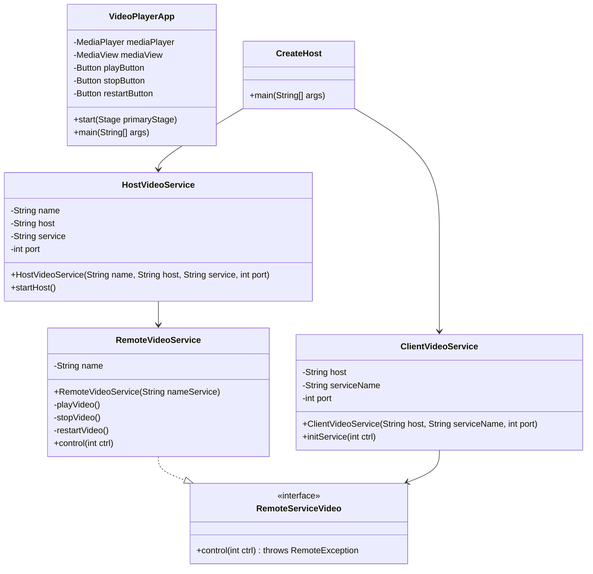

# Diagrama de Classes

## Estrutura Atual do Sistema

```mermaid
classDiagram
    class RemoteServiceVideo {
        <<interface>>
        +control(int ctrl) throws RemoteException
    }
    
    class RemoteVideoService {
        -String name
        +RemoteVideoService(String nameService)
        -playVideo()
        -stopVideo()
        -restartVideo()
        +control(int ctrl)
    }
    
    class HostVideoService {
        -String name
        -String host
        -String service
        -int port
        +HostVideoService(String name, String host, String service, int port)
        +startHost()
    }
    
    class ClientVideoService {
        -String host
        -String serviceName
        -int port
        +ClientVideoService(String host, String serviceName, int port)
        +initService(int ctrl)
    }
    
    class VideoPlayerApp {
        -MediaPlayer mediaPlayer
        -MediaView mediaView
        -Button playButton
        -Button stopButton
        -Button restartButton
        +start(Stage primaryStage)
        +main(String[] args)
    }
    
    class CreateHost {
        +main(String[] args)
    }
    
    RemoteVideoService ..|> RemoteServiceVideo
    HostVideoService --> RemoteVideoService
    ClientVideoService --> RemoteServiceVideo
    CreateHost --> HostVideoService
    CreateHost --> ClientVideoService
```
