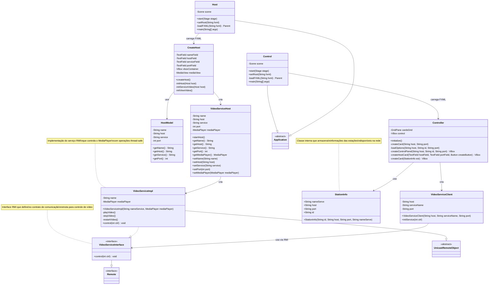

# Sistema de Controle de Vídeo com RMI

Sistema distribuído desenvolvido em JavaFX que permite controle remoto de reprodução de vídeos através de RMI (Remote Method Invocation). O projeto implementa uma arquitetura cliente-servidor onde múltiplas estações podem hospedar vídeos e serem controladas remotamente por clientes.

## 📋 Índice

- [Características](#características)
- [Arquitetura](#arquitetura)
- [Pré-requisitos](#pré-requisitos)
- [Estrutura do Projeto](#estrutura-do-projeto)
- [Instalação e Configuração](#instalação-e-configuração)
- [Como Usar](#como-usar)
- [Componentes Principais](#componentes-principais)
- [Protocolo de Comunicação](#protocolo-de-comunicação)
- [Funcionalidades](#funcionalidades)

## 🎯 Características

- **Interface Gráfica Moderna**: Interface JavaFX responsiva e intuitiva
- **Comunicação RMI**: Sistema distribuído com comunicação via RMI
- **Controle Remoto**: Play, Pause e Restart de vídeos remotamente
- **Múltiplas Estações**: Suporte para múltiplos hosts de vídeo
- **Descoberta Automática**: Descoberta automática de serviços RMI disponíveis
- **Arquitetura Modular**: Código bem estruturado seguindo boas práticas

## 🏗️ Arquitetura

O sistema segue uma arquitetura cliente-servidor distribuída:

```
┌─────────────────┐    RMI    ┌─────────────────┐
│     Cliente     │◄─────────►│      Host       │
│   (Controller)  │           │   (VideoHost)   │
│                 │           │                 │
│ - Descoberta    │           │ - MediaPlayer   │
│ - Interface UI  │           │ - RMI Registry  │
│ - Controles     │           │ - Video Service │
└─────────────────┘           └─────────────────┘
```

### Componentes:

- **Cliente (Control.java)**: Interface de controle que descobre e controla hosts
- **Host (Host.java)**: Servidor que hospeda e reproduz vídeos
- **Serviço RMI**: Camada de comunicação remota entre cliente e host

## 📊 Diagrama de Classes



## 📋 Pré-requisitos

- **Java JDK 11+** (com suporte a JavaFX)
- **JavaFX SDK** (se não incluído no JDK)
- **Maven** (para gerenciamento de dependências)
- **Lombok** (para anotações de código)

### Dependências Maven:

```xml
<dependencies>
    <dependency>
        <groupId>org.openjfx</groupId>
        <artifactId>javafx-controls</artifactId>
        <version>17.0.2</version>
    </dependency>
    <dependency>
        <groupId>org.openjfx</groupId>
        <artifactId>javafx-media</artifactId>
        <version>17.0.2</version>
    </dependency>
    <dependency>
        <groupId>org.openjfx</groupId>
        <artifactId>javafx-fxml</artifactId>
        <version>17.0.2</version>
    </dependency>
    <dependency>
        <groupId>org.projectlombok</groupId>
        <artifactId>lombok</artifactId>
        <version>1.18.24</version>
        <scope>provided</scope>
    </dependency>
</dependencies>
```

## 📁 Estrutura do Projeto

```
demo/
├── src/main/java/com/
│   ├── Control.java              # Aplicação cliente principal
│   ├── Host.java                 # Aplicação host principal
│   ├── controller/
│   │   ├── Controller.java       # Controller da interface cliente
│   │   └── CreateHost.java       # Controller para criação de host
│   ├── model/
│   │   └── Host.java             # Modelo de dados do host
│   ├── service/
│   │   ├── VideoServiceClient.java    # Cliente RMI
│   │   ├── VideoServiceHost.java      # Servidor RMI
│   │   ├── VideoServiceImpl.java      # Implementação do serviço
│   │   └── VideoServiceInterface.java # Interface RMI
│   └── view/
│       ├── controller.fxml       # Layout da interface cliente
│       └── host.fxml             # Layout da interface host
└── src/main/resources/
    └── video.mp4                 # Arquivo de vídeo de exemplo
```

## ⚙️ Instalação e Configuração

### 1. Clone o repositório
```bash
git clone https://github.com/anacleto-caua/RMI_Museum/
cd demo
```

### 2. Compile o projeto
```bash
mvn clean compile
```

### 3. Adicione o arquivo de vídeo
- Coloque seu arquivo de vídeo em `src/main/resources/video.mp4`
- Ou modifique o caminho no arquivo `CreateHost.java`

### 4. Configure as dependências JavaFX
```bash
# Para sistemas com JavaFX separado
export PATH_TO_FX=/path/to/javafx/lib
```

## 🚀 Como Usar

### Iniciando um Host (Servidor de Vídeo)

1. **Execute a aplicação Host:**
```bash
java --module-path $PATH_TO_FX --add-modules javafx.controls,javafx.media,javafx.fxml com.Host
```

2. **Configure o host:**
   - **Nome**: Identificador único para sua estação
   - **Host**: Endereço IP (localhost para testes locais)
   - **Serviço**: Nome do serviço RMI
   - **Porta**: Porta do RMI Registry (padrão: 1099)

3. **Clique em "Criar Host"** para inicializar o servidor

### Conectando como Cliente (Controlador)

1. **Execute a aplicação Cliente:**
```bash
java --module-path $PATH_TO_FX --add-modules javafx.controls,javafx.fxml com.Control
```

2. **Configure a conexão:**
   - **Endereço Host**: IP do servidor (localhost para testes locais)
   - **Porta**: Porta do RMI Registry (1099)

3. **Clique em "Procurar Host"** para descobrir estações disponíveis

4. **Selecione uma estação** clicando no card correspondente

5. **Use os controles:**
   - ▶️ **Play**: Iniciar reprodução
   - ⏸️ **Pause**: Pausar vídeo
   - 🔄 **Restart**: Reiniciar do início

## 🔧 Componentes Principais

### VideoServiceInterface
Interface RMI que define o contrato de comunicação:
```java
public interface VideoServiceInterface extends Remote {
    void control(int ctrl) throws RemoteException;
}
```

### Códigos de Controle
- `1`: Play
- `2`: Pause  
- `3`: Restart

### VideoServiceImpl
Implementação concreta do serviço que controla o MediaPlayer:
- Utiliza `Platform.runLater()` para operações thread-safe no JavaFX
- Gerencia estado do MediaPlayer (play, pause, seek)

### Controller
Controlador principal da interface cliente:
- Descoberta automática de serviços RMI via `Naming.list()`
- Interface dinâmica que se adapta aos hosts encontrados
- Gerenciamento de conexões RMI

## 📡 Protocolo de Comunicação

### Descoberta de Serviços
```java
String hostPort = "rmi://" + host + ":" + port + "/";
String[] objetos = Naming.list(hostPort);
```

### Chamada de Métodos Remotos
```java
String rmi = "rmi://" + host + ":" + port + "/" + serviceName;
VideoServiceInterface service = (VideoServiceInterface) Naming.lookup(rmi);
service.control(comando);
```

### Registro de Serviços
```java
LocateRegistry.createRegistry(porta);
Naming.rebind(rmi, serviceVideo);
```

## ✨ Funcionalidades

### Host (Servidor)
- ✅ Criação de RMI Registry
- ✅ Reprodução de vídeo local
- ✅ Exposição de serviços RMI
- ✅ Controle de MediaPlayer via RMI
- ✅ Interface gráfica para monitoramento

### Cliente (Controlador)
- ✅ Descoberta automática de hosts
- ✅ Interface gráfica intuitiva
- ✅ Conexão com múltiplos hosts
- ✅ Controles de reprodução remotos
- ✅ Visualização de estações disponíveis

## 🔍 Troubleshooting

### Problemas Comuns

**Erro: "Registry já estava rodando"**
- Normal se já existe um registry na porta
- O sistema continua funcionando normalmente

**Erro: "Connection refused"**
- Verifique se o host está rodando
- Confirme IP e porta corretos
- Verifique firewall/antivírus

**Vídeo não encontrado**
- Verifique se `video.mp4` está em `src/main/resources/`
- Confirme o formato do arquivo (MP4 recomendado)

**Interface não aparece**
- Verifique se JavaFX está instalado
- Confirme os módulos no comando de execução

### Logs e Debug
- Console mostra status de conexões RMI
- Erros de rede são logados com stack trace
- Status de reprodução é exibido no console

### Padrões de Código
- Use Lombok para reduzir boilerplate
- Siga convenções Java (camelCase, PascalCase)
- Documente métodos complexos
- Trate exceções adequadamente

---

**Nota**: Este é um projeto educacional que demonstra conceitos de sistemas distribuídos com RMI e JavaFX. Para uso em produção, considere implementar autenticação, criptografia e tratamento robusto de erros.
